# Fake News Detection Using Machine Learning
Group Member:  Chieh Su, Mingqian Gao, Yuxin Zhao, and Chenzi Jin

Chieh Su: main pipeline, data cleaning, naive bayes, logistic regression, code formatting

Mingqian Gao: Gaussian Naive Bayes, SBERT Embedding, SBERT+classfiers, SBERT Pipeline

Yuxin Zhao: BERT fine-tuning, performance evaluation & visualization, evaluation pipeline, model comparison, evaluation analysis

Chenzi Jin: 

## Introduction

The rapid spread of misinformation online has made fake news detection an increasingly important problem in machine learning and natural language processing. False or misleading news articles can influence public opinion, amplify social division, and undermine trust in legitimate media sources. As digital platforms continue to become primary channels for news consumption, scalable and automated methods for identifying fake news are becoming increasingly essential.

In this project, we investigate whether machine learning models can accurately distinguish between **real news** and **fake news** based solely on article text. We formulate this as a **binary classification problem**, where each article is labeled as either:

- **0 = Real News**
- **1 = Fake News**

Our goal is to compare multiple machine learning approaches for fake news detection and evaluate their predictive performance, robustness, and practical strengths and limitations.

To accomplish this, we explore a range of modeling strategies, including traditional supervised classification models, transformer-based language models, and anomaly detection methods. By comparing these approaches, we aim to better understand which techniques are most effective for automated fake news detection.

## Dataset

For this project, we use the **WELFake Dataset**, a publicly available dataset for fake news classification.


### Source

- Dataset: WELFake Dataset
- Platform: Kaggle
- Link: https://www.kaggle.com/datasets/saurabhshahane/fake-news-classification
- Creator: Saurabh Shahane

The WELFake dataset was created by combining several existing fake news and real news datasets into a single large corpus for binary text classification. The goal of the dataset is to support research on automated fake news detection using machine learning and natural language processing techniques.

### Features

The original dataset contains the following columns:

| Column | Description |
|---|---|
| `title` | Headline of the news article |
| `text` | Main body text of the article |
| `label` | Binary label for classification (`0 = Real`, `1 = Fake`) |

For our modeling pipeline, we primarily use the **article text (`text`)** as the predictive feature and the **label** as the target variable.

### Data Size

The raw dataset contains approximately **72,000+ news articles**, making it sufficiently large for supervised learning models.

After preprocessing, our final dataset size is reduced due to:

- removal of missing values
- removal of duplicated articles
- removal of URLs and formatting artifacts
- filtering out extremely short articles
- text normalization and cleaning

This ensures higher data quality and reduces noise in downstream modeling.

### Data Collection Background and Limitations

Because WELFake is an aggregated dataset compiled from multiple news datasets, it contains writing styles, topics, and publication sources from a variety of outlets. This diversity is helpful for building generalized fake news detection models.

However, this also introduces several challenges:

- **Source bias**: certain publishers may have consistent writing patterns that models can overfit to
- **Labeling bias**: article labels depend on the original source datasets and may contain inconsistencies
- **Temporal drift**: writing styles and misinformation strategies evolve over time
- **Dataset artifacts**: formatting tokens, media references, and duplicated content may leak signals unrelated to factual accuracy

These limitations should be considered when interpreting model performance.

## Experiment Design

We adopt a controlled comparison framework:

- Same dataset and preprocessing
- Same 80/20 train-test split
- Same evaluation metrics

We compare three types of feature representations:

1. TF-IDF (lexical features)
2. SBERT (semantic embeddings)
3. Fine-tuned BERT (end-to-end learning)

For TF-IDF and SBERT, we evaluate multiple classifiers:
- Logistic Regression
- XGBoost
- Naive Bayes
---


## TF-IDF-based Models

### Method

We use **TF-IDF (Term Frequency–Inverse Document Frequency)** vectorization to convert cleaned news articles into numerical feature representations suitable for machine learning classification.

Compared to dense embedding methods such as SBERT, TF-IDF produces a sparse representation that emphasizes informative words and short phrases while reducing the influence of overly common terms.

We evaluate the following classifiers on top of TF-IDF features:

- **Logistic Regression**  
  A strong linear baseline for text classification that performs well on high-dimensional sparse features and provides interpretable results.

- **Multinomial Naive Bayes**  
  A probabilistic model widely used in text mining that is computationally efficient and particularly well-suited for sparse count-based or TF-IDF representations.

- **XGBoost**  
  A gradient boosting model capable of capturing nonlinear patterns and feature interactions, providing a stronger ensemble benchmark beyond linear models.

Each model is assessed using **Accuracy**, **Precision**, **Recall**, **F1-score**, and **ROC-AUC**.

---

### Implementation

We use Scikit-learn's TF-IDF vectorizer to transform cleaned article text into numerical feature representations for downstream classification models.

Key settings:

- Maximum features: 50,000  
- N-gram range: (1, 2)  
- Stop words removal: English  
- Representation: sparse TF-IDF matrix

This representation captures:

- informative keywords  
- short phrase patterns  
- rare but meaningful terms  
- reduced influence of overly common words

The resulting TF-IDF features are then used as inputs for Logistic Regression, Multinomial Naive Bayes, and XGBoost.

---

### Results

| Model | Accuracy | Precision | Recall | F1 Score | ROC-AUC |
|---|---:|---:|---:|---:|---:|
| **TF-IDF + Logistic Regression** | **0.933** | **0.926** | **0.920** | **0.923** | **0.981** |
| **TF-IDF + XGBoost** | **0.921** | **0.907** | **0.914** | **0.910** | **0.977** |
| **TF-IDF + MultinomialNB** | **0.864** | **0.831** | **0.863** | **0.847** | **0.938** |

---

### Visualization

**ROC Curve**

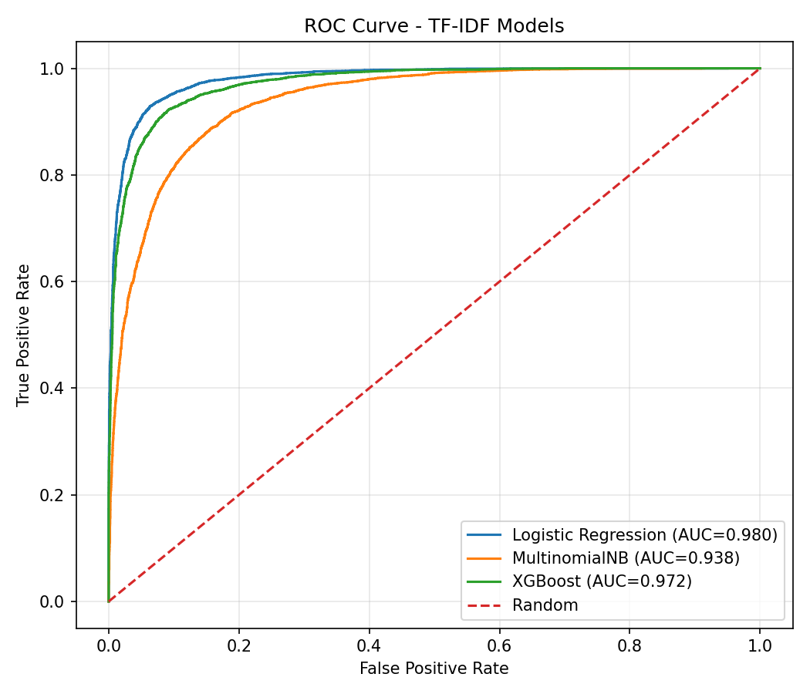

**Confusion Matrices**

- TF-IDF + Logistic Regression  
  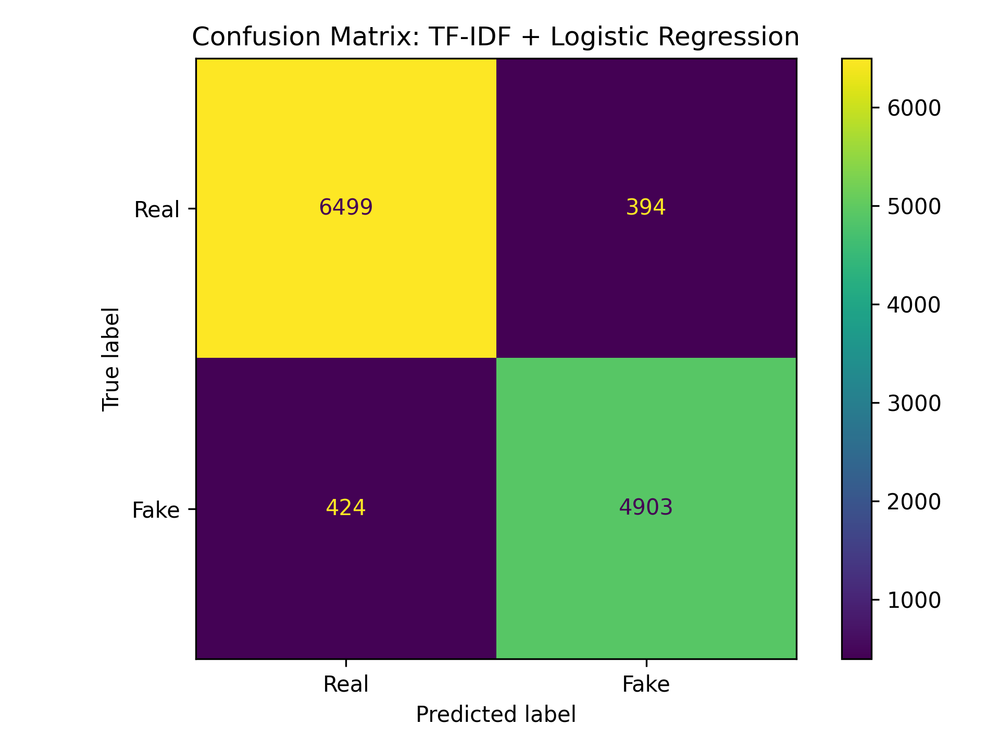

- TF-IDF + MultinomialNB  
  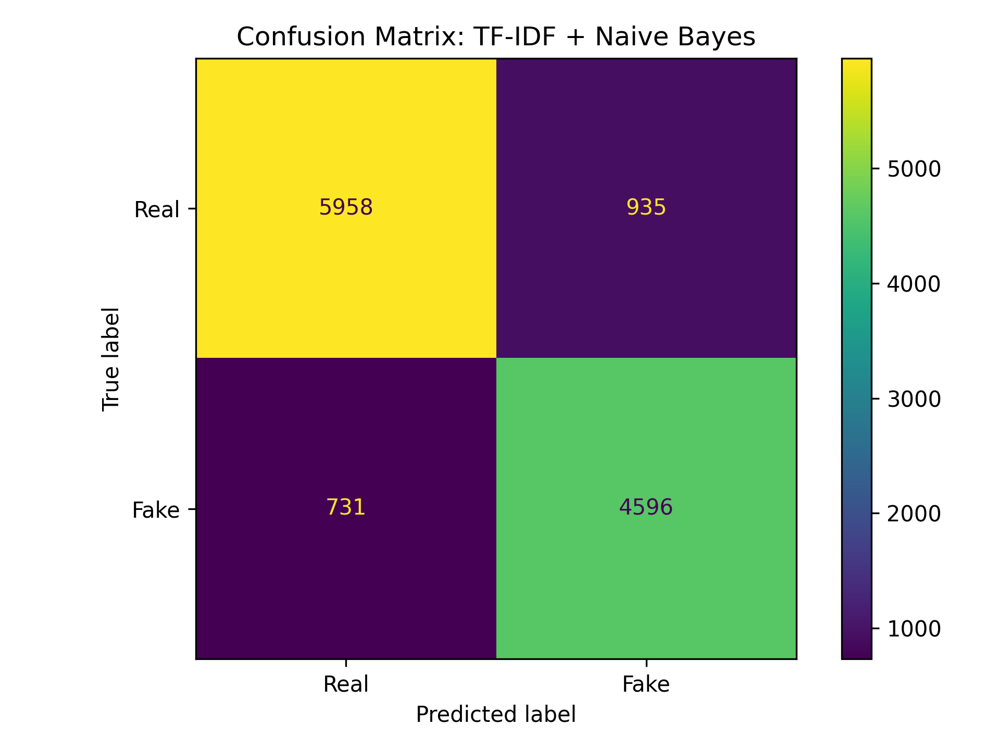

- TF-IDF + XGBoost  
  

---

### Analysis

TF-IDF-based models achieve strong predictive performance overall, with **Logistic Regression performing best**, reaching **93.3% accuracy** and **0.981 ROC-AUC**.

XGBoost also performs very strongly, achieving comparable results while providing a nonlinear modeling perspective that can capture more complex feature interactions.

Multinomial Naive Bayes performs noticeably worse than the other two models, although it still provides a reasonable baseline. This suggests that while simple probabilistic assumptions capture some signal, more flexible decision boundaries substantially improve classification performance.

---

## SBERT-based Models

### Method

We use Sentence-BERT (SBERT) to obtain dense semantic representations of news articles. Compared to traditional feature-based methods such as TF-IDF, SBERT captures contextual and semantic information at the sentence level.


We evaluate the following classifiers on top of SBERT embeddings:

- Logistic Regression  
- XGBoost  
- Gaussian Naive Bayes

Gaussian Naive Bayes is included as a simple probabilistic baseline. It assumes that features are independent and follow a Gaussian distribution. While these assumptions do not hold well for SBERT embeddings (which are high-dimensional and correlated), it provides a useful reference point to understand how model assumptions affect performance. We do not use the Multinomial Naive Bayes implementation from because it is specifically designed for count-based or frequency-based features such as TF-IDF. MultinomialNB assumes that all input features are non-negative (e.g., word counts or term frequencies). However, SBERT embeddings are dense, continuous vectors that can contain both positive and negative values.

---

### Implementation

We use the pre-trained model: sentence-transformers/all-MiniLM-L6-v2 (available at: https://huggingface.co/sentence-transformers/all-MiniLM-L6-v2) 


Key settings:

- Embedding dimension: 384  
- Batch size: 32  

---

### Results

| Model | Accuracy | Precision | Recall | F1 Score | ROC-AUC |
|---|---:|---:|---:|---:|---:|
| SBERT + XGBoost | 0.862 | 0.865 | 0.811 | 0.837 | 0.935 |
| SBERT + Logistic Regression | 0.861 | 0.859 | 0.815 | 0.837 | 0.934 |
| SBERT + Gaussian NB | 0.727 | 0.673 | 0.723 | 0.698 | 0.807 |

---

### Visualization

**ROC Curve**

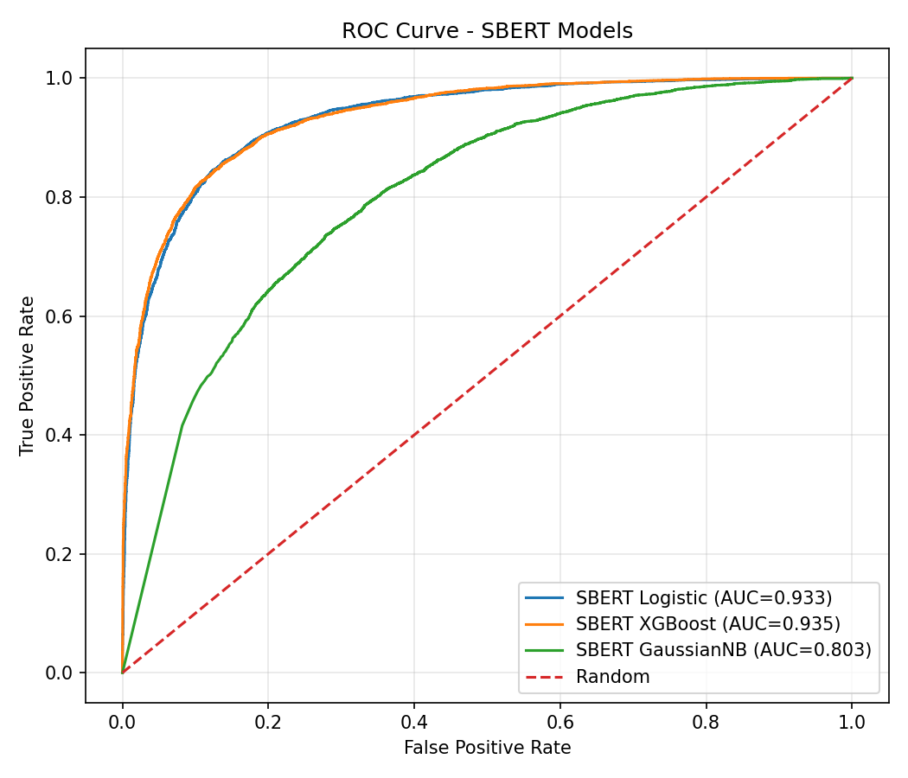

**Confusion Matrices**

- SBERT + Logistic  
  

- SBERT + XGBoost  
  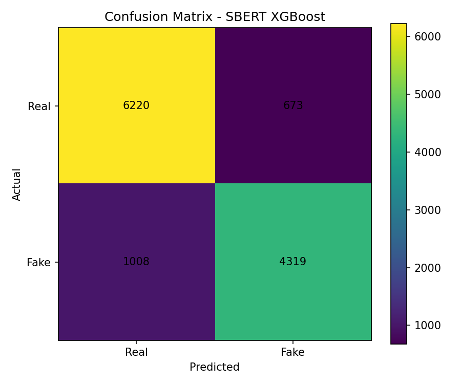
  
- SBERT + GaussianNB  
  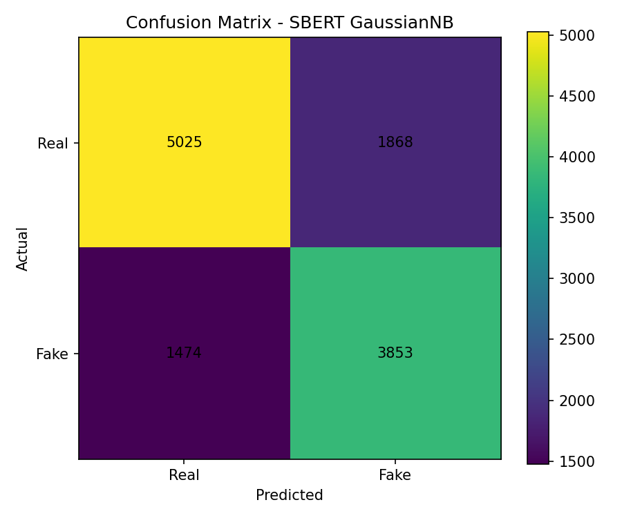

---

### Analysis

SBERT-based models achieve strong performance, with Logistic Regression and XGBoost reaching accuracy around 86% and ROC-AUC above 0.93.

In contrast, Gaussian Naive Bayes performs substantially worse, with accuracy dropping to around 73%.

This gap can be explained by the underlying assumptions of the model:

- Gaussian Naive Bayes assumes **feature independence**  
- It also assumes each feature follows a **Gaussian distribution**

However, SBERT embeddings are:

- **high-dimensional**
- **dense and correlated across dimensions**
- **not Gaussian-distributed**

As a result, the assumptions of Naive Bayes are strongly violated, leading to degraded performance.

From the confusion matrix, GaussianNB produces:

- significantly more **false positives**
- and more **false negatives**

indicating weaker class separation compared to Logistic Regression and XGBoost.

Overall, this highlights that:

> **model assumptions must align with representation structure** and that not all classifiers are suitable for dense semantic embeddings.

An important finding is that **TF-IDF consistently outperforms SBERT embeddings on this dataset**, indicating that lexical patterns, keyword usage, and phrase frequency carry highly discriminative information for fake news detection.


---

## Fine-tuned BERT Models

### Method

We fine-tune a transformer-based language model for fake news classification.

Unlike TF-IDF and SBERT pipelines that rely on fixed feature representations, fine-tuned BERT updates model parameters directly on the classification task, allowing the model to learn task-specific semantic patterns from the news text.

This approach captures contextual meaning, long-range dependencies, and subtle linguistic cues useful for distinguishing fake and real news.

---

### Implementation

We use the pre-trained model:

`distilbert-base-uncased`

Key settings:

- Epochs: 2
- Learning rate: 2e-5
- Max length: 256
- Batch size: 8
- Optimizer: AdamW (default HuggingFace Trainer)

---

### Results

| Model | Accuracy | Precision | Recall | F1 Score |
|------|----------|-----------|--------|----------|
| Fine-tuned DistilBERT | 0.989 | 0.992 | 0.984 | 0.988 |

Confusion Matrix:

- True Negative: 6850
- False Positive: 43
- False Negative: 86
- True Positive: 5241

---

### Visualization

**Confusion Matrices**

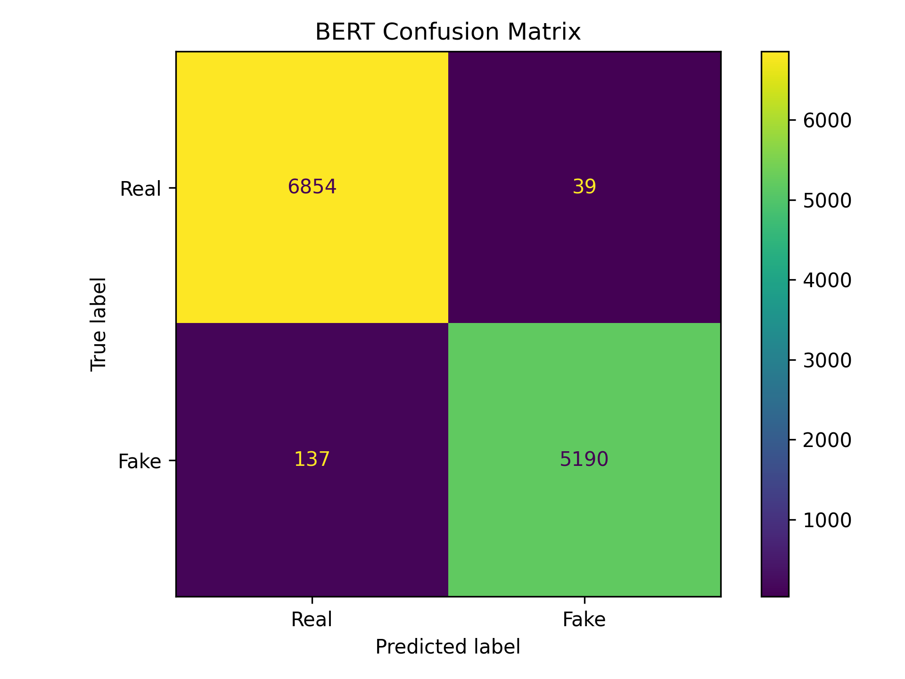

---

### Analysis
Fine-tuned DistilBERT achieves the strongest performance among all tested models, reaching nearly 99% accuracy.

This suggests that end-to-end transformer fine-tuning substantially outperforms feature-based pipelines such as TF-IDF and SBERT on this dataset.

The result indicates that contextual language understanding and task-specific adaptation are highly effective for fake news detection.

---

## Anomaly Detection Analysis

### Method

Beyond supervised classification, we investigate whether fake news articles exhibit anomalous linguistic patterns that unsupervised methods can detect without labels.

Both models are trained **only on real news** (27,573 samples, label=0), so they learn what "normal" journalism looks like. At test time, articles that deviate from these learned patterns are flagged as anomalies. Two complementary approaches are used:

- **Isolation Forest (IF):** Builds 200 random trees that isolate observations through recursive splits. Points that require fewer splits to isolate receive lower anomaly scores, as they are structurally distinct from the majority.

- **One-Class SVM (OC-SVM):** Learns a decision boundary around the training distribution in a reduced feature space. To handle the high dimensionality of TF-IDF vectors (50,000 features), we first apply Truncated SVD to project into 100 dimensions before fitting the RBF kernel.

Both methods use a contamination rate of 10%.

---

### Results

| Method | Anomalies Detected | Fake Ratio in Anomalies | Enrichment | Mann-Whitney p |
|--------|-------------------|------------------------|------------|----------------|
| Isolation Forest | 1,099 (9.0%) | 32.21% | 0.74x | 3.09e-38 *** |
| One-Class SVM | 642 (5.3%) | 6.70% | 0.15x | 0.00e+00 *** |
| Overall baseline | — | 43.59% | 1.00x | — |

Method agreement: 87.29% — the two methods largely agree on which samples are normal vs anomalous, with 94 samples flagged by both. Among these, only 4.26% are fake.

**Visualization**

- Score Distributions

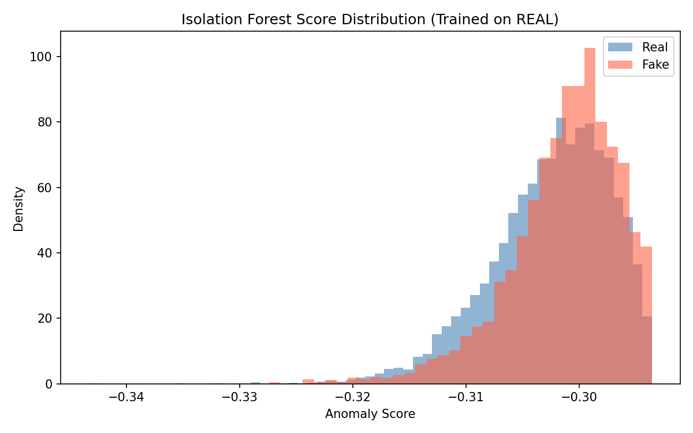
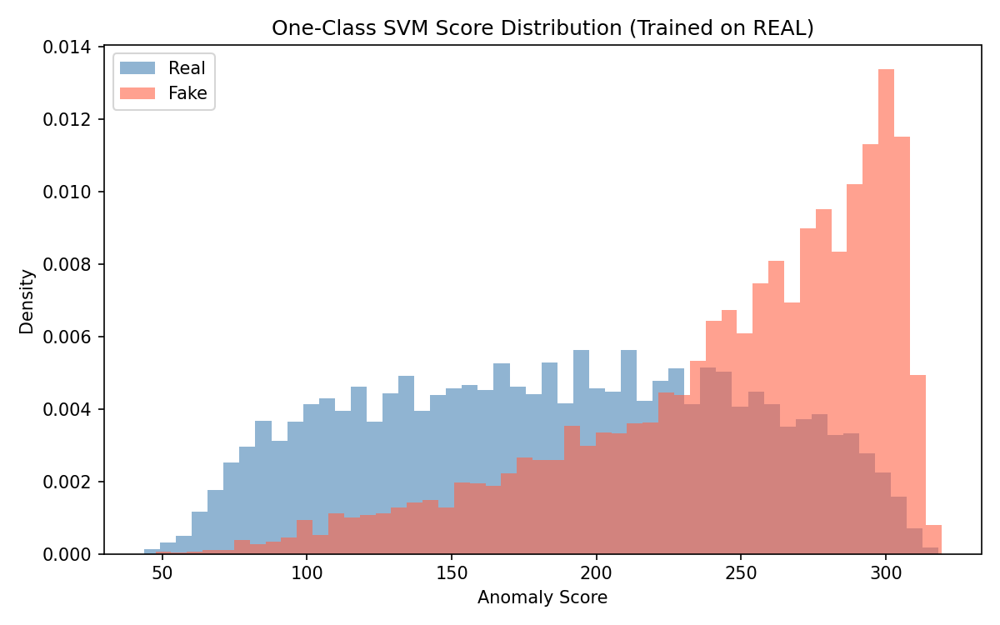

- Fake Ratio Comparison

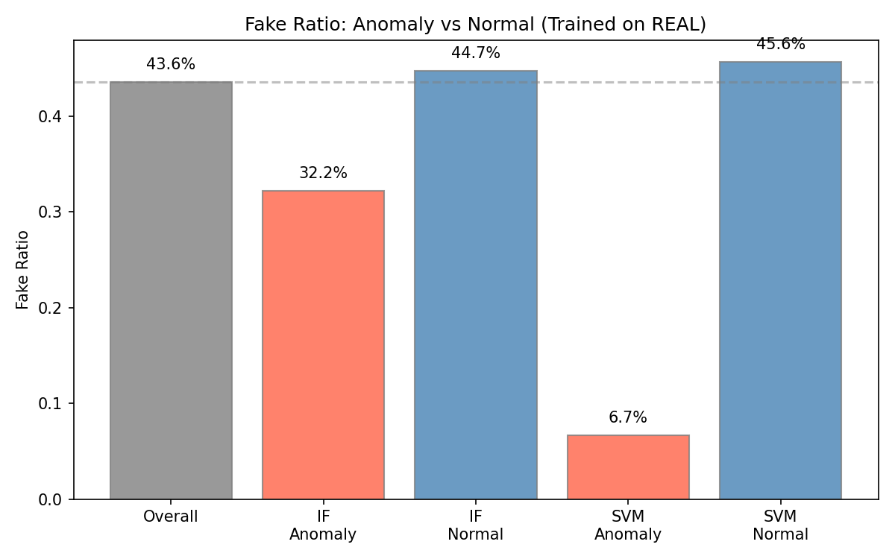

- Method Agreement

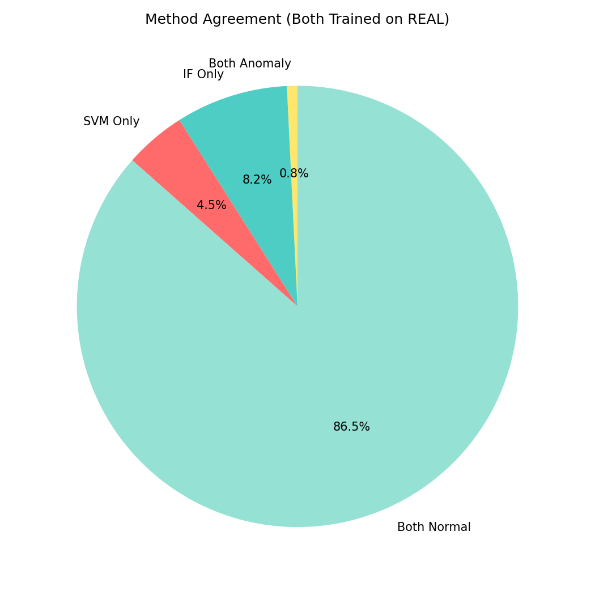

- PR Curves

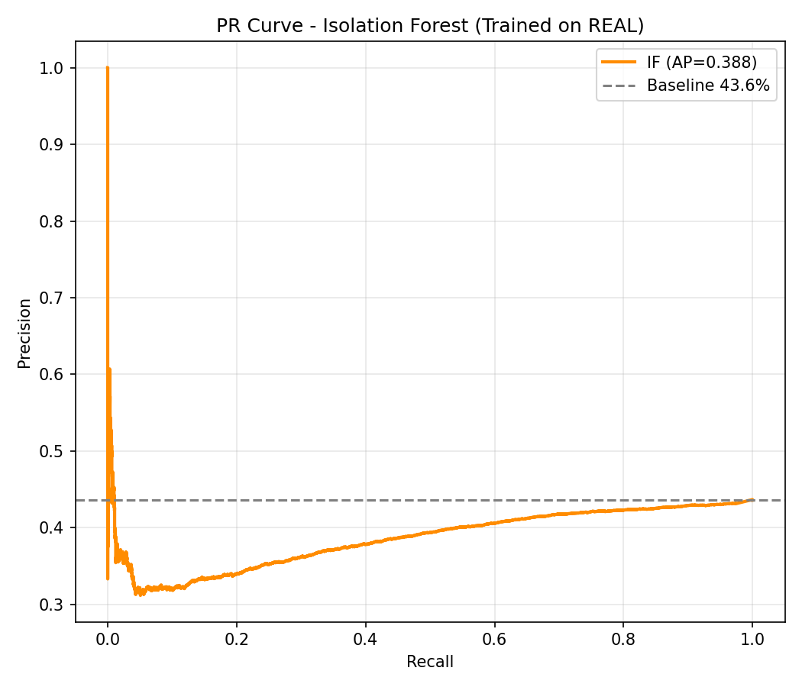
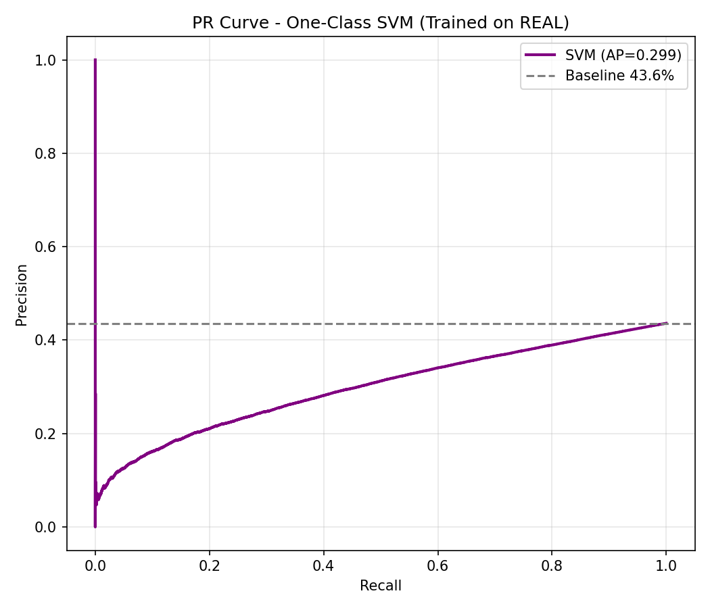

---

### Analysis

Both anomaly detection methods produce statistically significant results (Mann-Whitney p < 0.001), confirming that anomaly scores carry meaningful information about article authenticity.

The key finding is that anomalies are disproportionately **real news, not fake**. When trained only on real news patterns, the One-Class SVM is particularly striking: only 6.70% of its flagged anomalies are fake (enrichment 0.15x), meaning the most "unusual" articles are overwhelmingly genuine. The 94 articles flagged by both methods contain just 4.26% fake news — nearly ten times lower than the overall baseline of 43.59%.

This reveals an important insight about the nature of misinformation: **fake news follows more predictable, formulaic language patterns**, while genuine journalism — with its diverse topics, writing styles, and source-specific conventions — produces more structural outliers in the TF-IDF feature space. In other words, fake news occupies a surprisingly narrow and homogeneous region, whereas real news is far more varied.

From a practical standpoint, these results complement the supervised XGBoost classifier by offering an alternative lens: rather than asking "is this article fake?", anomaly detection shows that the textual diversity of real journalism is itself a distinguishing characteristic — one that could be leveraged in future detection systems.

---

## Evaluation

We compare the performance of all models using standard classification metrics, including **Accuracy, Precision, Recall, F1-score, and ROC-AUC**.

### Model Comparison

| Model | Accuracy | Precision | Recall | F1 Score | ROC-AUC |
|------|----------|-----------|--------|----------|---------|
| Fine-tuned DistilBERT | 0.986 | 0.993 | 0.974 | **0.983** | — |
| TF-IDF + Logistic Regression | 0.933 | 0.926 | 0.920 | 0.923 | 0.981 |
| TF-IDF + XGBoost | 0.913 | 0.896 | 0.905 | 0.900 | 0.972 |
| TF-IDF + Multinomial NB | 0.864 | 0.831 | 0.863 | 0.847 | 0.938 |
| SBERT + XGBoost | 0.862 | 0.865 | 0.811 | 0.837 | 0.935 |
| SBERT + Logistic Regression | 0.861 | 0.859 | 0.815 | 0.837 | 0.934 |
| SBERT + Gaussian NB | 0.727 | 0.673 | 0.723 | 0.698 | 0.807 |

---

### Key Findings

- **Fine-tuned DistilBERT achieves the best performance across all models**, with an F1 score of **0.983** and accuracy close to **98.6%**  
- **TF-IDF + Logistic Regression** performs strongly as a classical baseline, with an F1 score of **0.923** and high ROC-AUC  
- **XGBoost models** also perform well, but slightly below TF-IDF + Logistic Regression  
- **SBERT-based models do not outperform TF-IDF-based models**, suggesting dense embeddings are not necessarily superior for this task  
- **Gaussian Naive Bayes performs the worst**, likely due to its strong independence and distribution assumptions  

---

### Interpretation

These results suggest that:

- **Fine-tuned transformer models (BERT)** significantly improve performance by capturing contextual and semantic information  
- **TF-IDF remains a strong and efficient baseline**, especially when combined with Logistic Regression  
- The weaker performance of SBERT-based models may be due to:
  - high-dimensional dense representations  
  - correlation between features  
  - mismatch with model assumptions  

---

### Conclusion

Overall, model performance depends heavily on both feature representation and model choice.  
While classical methods remain competitive, **fine-tuned transformer-based models achieve the best results and provide the most reliable performance for fake news classification in this project**  

---

## Appendix

### How to Reproduce the Results

#### 1. Install dependencies

Install the required Python packages:

```bash
pip install -r requirements.txt
```

#### 2. Download the dataset

Download the **WELFake Dataset** from Kaggle:

https://www.kaggle.com/datasets/saurabhshahane/fake-news-classification

The raw dataset is not included in this repository due to GitHub file size limitations. 

After downloading, place the CSV file in:

```text
data/raw/WELFake_Dataset.csv
```

#### 3. Run the full pipeline

```bash
python code/main.py
```

This script will:

- clean and preprocess the raw dataset
- generate train/test splits
- create feature representations
- train machine learning models
- evaluate model performance
- generate visualizations
- save model outputs and summary results

#### Output

Results generated by `main.py` will be saved in:

```text
results/
├── csv/
└── figures/
```

#### Reproducibility Note

We fix data splitting and model randomness using `random_state=42` where applicable to improve reproducibility.

However, slight numerical differences may still occur across different machines due to differences in operating systems, package versions, floating-point computation, hardware, and parallel computation in some model implementations.

These differences are expected to be very small and should not materially affect the overall conclusions.
