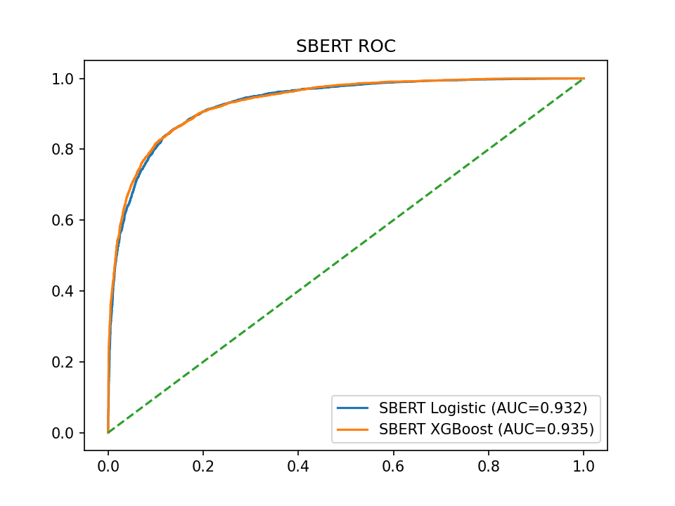
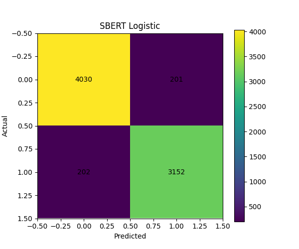
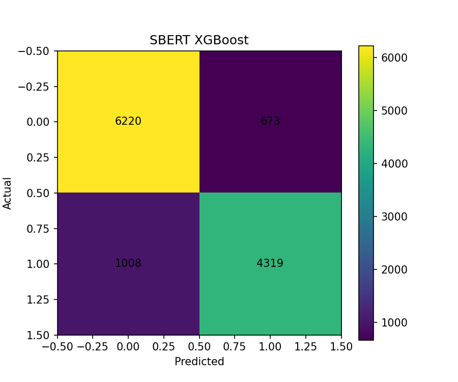

# Fake News Detection Using Machine Learning

## Introduction

The rapid spread of misinformation online has made fake news detection an increasingly important problem in machine learning and natural language processing. False or misleading news articles can influence public opinion, amplify social division, and undermine trust in legitimate media sources. As digital platforms continue to become primary channels for news consumption, scalable and automated methods for identifying fake news are becoming essential.

In this project, we investigate whether machine learning models can accurately distinguish between **real news** and **fake news** based solely on article text. We formulate this as a **binary classification problem**, where each article is labeled as either:

- **0 = Real News**
- **1 = Fake News**

Our goal is to compare multiple modeling approaches for fake news detection and determine which methods provide the best balance between predictive performance, robustness, and interpretability.

To study this problem, we explore three different machine learning perspectives:

### 1. Traditional Supervised Classification
We first establish strong baseline models using classical text feature engineering methods such as **TF-IDF**, combined with classifiers including:

- **Logistic Regression**
- **Naive Bayes**
- **XGBoost**

These models are computationally efficient, interpretable, and serve as strong benchmarks for text classification.

### 2. Deep Learning and Transformer-Based Models
We then investigate modern NLP approaches using **Sentence-BERT embeddings** and **fine-tuned BERT models**, which can capture contextual meaning, semantic relationships, and deeper linguistic patterns beyond simple word frequency representations.

These methods allow us to test whether pretrained language models significantly improve fake news detection performance over traditional approaches.

### 3. Anomaly Detection
In addition to supervised classification, we explore **anomaly detection methods** as an alternative framework for fake news detection.

Rather than directly learning to classify fake versus real news, anomaly detection models learn the distribution of legitimate news articles and identify fake news as statistically unusual or out-of-distribution observations. This approach may be especially useful when labeled fake news examples are scarce or when new forms of misinformation emerge that differ from historical training data.

By comparing supervised classification, transformer-based methods, and anomaly detection, we aim to better understand:

- how fake news differs from legitimate news in textual patterns,
- whether deep contextual models outperform classical NLP pipelines,
- and whether fake news can be effectively detected as a form of statistical anomaly.

We evaluate all approaches using standard classification metrics including **Accuracy**, **Precision**, **Recall**, **F1-score**, and **ROC-AUC**, and discuss their strengths, weaknesses, and practical implications for real-world misinformation detection systems.

## Dataset

For this project, we use the **WELFake Dataset**, a publicly available dataset for fake news classification.

### Source

- Dataset: WELFake Dataset
- Platform: Kaggle
- Link: https://www.kaggle.com/datasets/saurabhshahane/fake-news-classification
- Creator: Saurabh Shahane

The WELFake dataset was created by combining several existing fake news and real news datasets into a single large corpus for binary text classification. The goal of the dataset is to support research on automated fake news detection using machine learning and natural language processing techniques.

### Features

The original dataset contains the following columns:

| Column | Description |
|---|---|
| `title` | Headline of the news article |
| `text` | Main body text of the article |
| `label` | Binary label for classification (`0 = Real`, `1 = Fake`) |

For our modeling pipeline, we primarily use the **article text (`text`)** as the predictive feature and the **label** as the target variable.

### Data Size

The raw dataset contains approximately **72,000+ news articles**, making it sufficiently large for supervised learning models.

After preprocessing, our final dataset size is reduced due to:

- removal of missing values
- removal of duplicated articles
- removal of URLs and formatting artifacts
- filtering out extremely short articles
- text normalization and cleaning

This ensures higher data quality and reduces noise in downstream modeling.

### Data Collection Background and Limitations

Because WELFake is an aggregated dataset compiled from multiple news datasets, it contains writing styles, topics, and publication sources from a variety of outlets. This diversity is helpful for building generalized fake news detection models.

However, this also introduces several challenges:

- **Source bias**: certain publishers may have consistent writing patterns that models can overfit to
- **Labeling bias**: article labels depend on the original source datasets and may contain inconsistencies
- **Temporal drift**: writing styles and misinformation strategies evolve over time
- **Dataset artifacts**: formatting tokens, media references, and duplicated content may leak signals unrelated to factual accuracy

These limitations should be considered when interpreting model performance.

## SBERT-based Models

### Method

We use Sentence-BERT (SBERT) to obtain dense semantic representations of news articles. Compared to traditional feature-based methods such as TF-IDF, SBERT captures contextual and semantic information at the sentence level.

We evaluate the following classifiers on top of SBERT embeddings:

- Logistic Regression  
- XGBoost  
- Gaussian Naive Bayes  

---

### Implementation

We use the pre-trained model: sentence-transformers/all-MiniLM-L6-v2 (available at: https://huggingface.co/sentence-transformers/all-MiniLM-L6-v2) 

Key settings:

- Embedding dimension: 384  
- Batch size: 32  

---

### Results

| Model              | Accuracy | Precision | Recall | F1 Score | ROC-AUC |
|------------------|---------|----------|--------|---------|--------|
| SBERT + Logistic | 0.860   | 0.832    | 0.851  | 0.841   | 0.932 |
| SBERT + XGBoost  | 0.862   | 0.865    | 0.811  | 0.837   | 0.935 |
| SBERT + GaussianNB | 0.763 | 0.673    | 0.723  | 0.697   | — |

---

### Visualization

**ROC Curve**

**Confusion Matrices**

- SBERT + Logistic  
  

- SBERT + XGBoost  
  
  
- SBERT + GaussianNB  
  

---

### Analysis

SBERT-based models achieve strong performance, with Logistic Regression and XGBoost reaching accuracy around 86% and ROC-AUC above 0.93.

In contrast, Gaussian Naive Bayes performs substantially worse, with accuracy dropping to around 76%.

This gap can be explained by the underlying assumptions of the model:

- Gaussian Naive Bayes assumes **feature independence**  
- It also assumes each feature follows a **Gaussian distribution**

However, SBERT embeddings are:

- **high-dimensional**
- **dense and correlated across dimensions**
- **not Gaussian-distributed**

As a result, the assumptions of Naive Bayes are strongly violated, leading to degraded performance.

From the confusion matrix, GaussianNB produces:

- significantly more **false positives**
- and more **false negatives**

indicating weaker class separation compared to Logistic Regression and XGBoost.

Overall, this highlights that:

> **model assumptions must align with representation structure** and that not all classifiers are suitable for dense semantic embeddings.
---

### TBD

A comparison with TF-IDF-based models .

